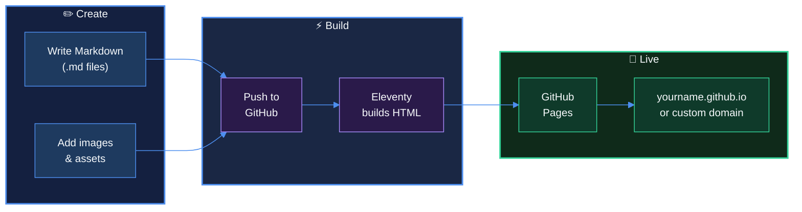

# trag.dev

A fast, clean personal site built with [Eleventy](https://www.11ty.dev/) and [Pico CSS](https://picocss.com/). Content is written in Markdown — update a `.md` file, push, and the site deploys automatically via GitHub Actions.

**Live site:** [trag.dev](https://trag.dev)

## How It Works



You write content in Markdown. When you push to `main`, GitHub Actions runs Eleventy to build static HTML, then deploys it to GitHub Pages. Your site is live at `username.github.io` — no server, no hosting costs. A custom domain is optional.

## Remix This Site

This repo is designed to be remixed. Fork it, clone it, whatever works for you — then make it yours.

### Quick start

```bash
# 1. Clone or fork this repo
git clone https://github.com/chris-trag/chris-trag.github.io.git my-site
cd my-site

# 2. Install dependencies
npm install

# 3. Start the dev server
npm run dev

# 4. Open http://localhost:8080
```

### What to change

| File | What to do |
|---|---|
| `src/index.md` | Replace with your own bio, links, and headshot |
| `src/speaking.md`, `src/writing.md`, `src/shelf.md` | Edit or delete — these are optional pages |
| `src/img/global/` | Swap in your own headshot and OG card image |
| `src/css/custom.css` | Change the color palette and fonts (see below) |
| `src/_includes/base.njk` | Update site name, OG defaults, analytics ID, and social links |
| `src/site.webmanifest` | Update with your site name and colors |
| `src/robots.txt` | Update the sitemap URL to your domain |

### Using an AI agent to remix

If you're using an AI coding agent (Claude Code, Gemini CLI, GitHub Copilot, Kiro, etc.), point it at the **[REMIX.md](.github/REMIX.md)** file:

```
Read https://github.com/chris-trag/chris-trag.github.io/blob/main/.github/REMIX.md and follow the instructions to remix this site for me.
My name is [YOUR NAME], I'm a [YOUR ROLE] at [YOUR COMPANY].
My site will be hosted at [YOUR DOMAIN].
```

The REMIX file tells the agent to generate a unique color palette and font pairing — not copy the original.

## Deploying to GitHub Pages

Your site will be live at `https://username.github.io` automatically — no custom domain required.

### First-time setup

1. Name your repo `username.github.io` (replace `username` with your GitHub username)
2. Go to repo **Settings → Pages**
3. Under "Build and deployment", set Source to **GitHub Actions**
4. Push any change to `main` — the included workflow (`.github/workflows/deploy.yml`) handles the rest

Your site will be live at `https://username.github.io` within a few minutes.

### Custom domain (optional)

If you have your own domain (e.g., `janedoe.dev`):

1. In repo **Settings → Pages → Custom domain**, enter your domain
2. Add DNS records with your registrar — see [GitHub's custom domain docs](https://docs.github.com/en/pages/configuring-a-custom-domain-for-your-github-pages-site)
3. GitHub will auto-create a `CNAME` file in your repo
4. Update `src/robots.txt` and OG URLs to use your domain

Without a custom domain, everything works at `username.github.io` — no extra steps needed.

## Project Structure

```
.
├── .eleventy.js              # Eleventy config, markdown plugins, shortcodes
├── .github/
│   ├── workflows/deploy.yml  # Auto-deploy to GitHub Pages on push
│   └── REMIX.md              # Instructions for AI agents remixing this site
├── src/
│   ├── _includes/base.njk    # HTML layout template (head, nav, footer)
│   ├── css/
│   │   ├── custom.css        # All custom styles, colors, typography
│   │   ├── fonts.css         # Self-hosted font declarations
│   │   ├── nav-icons.css     # Navigation icon styles
│   │   └── pico.min.css      # Pico CSS framework
│   ├── fonts/                # Self-hosted Work Sans + Flaticon icon subsets
│   ├── img/                  # Images, favicons, OG card
│   ├── js/
│   │   ├── theme.js          # Dark/light mode toggle + system preference
│   │   └── copy.js           # Copy-to-clipboard for speaker bio
│   ├── index.md              # Homepage
│   ├── speaking.md           # Speaking page
│   ├── writing.md            # Writing page
│   ├── shelf.md              # Bookshelf page
│   ├── sink.md               # Kitchen sink — shows all available elements
│   ├── robots.txt            # SEO robots file
│   ├── site.webmanifest      # PWA manifest
│   └── sitemap.xml.njk       # Auto-generated sitemap
├── dist/                     # Built output (generated, not committed)
└── package.json              # Dependencies: eleventy, markdown-it plugins, luxon
```

## Tech Stack

- **Static site generator:** [Eleventy (11ty)](https://www.11ty.dev/) v2
- **CSS framework:** [Pico CSS](https://picocss.com/) with custom theme
- **Fonts:** [Work Sans](https://fonts.google.com/specimen/Work+Sans) (self-hosted, variable weight)
- **Icons:** [Flaticon UIcons](https://www.flaticon.com/uicons) (self-hosted, subset to ~3KB)
- **Markdown:** markdown-it with attrs, mark, and container plugins
- **Deployment:** GitHub Actions → GitHub Pages
- **Analytics:** Google Analytics 4

## Customization

### Colors

All colors are CSS custom properties in `src/css/custom.css`. Light mode and dark mode have separate palettes:

```css
:root:not([data-theme=dark]), [data-theme=light] {
    --primary: #1155cc;          /* Main accent */
    --color-bg: #ffffff;         /* Background */
    --color-text: #2e2e2e;       /* Body text */
    --link-color: #0066cc;       /* Links */
}

[data-theme=dark] {
    --primary: #4d8eee;
    --color-bg: #0a0c14;
    --color-text: #f7fafc;
    --link-color: #4d8eee;
}
```

### Fonts

Font files live in `src/fonts/` with `@font-face` declarations in `src/css/fonts.css`. To change fonts:

1. Download your font as `.woff2` and drop it in `src/fonts/`
2. Update the `@font-face` in `src/css/fonts.css`
3. Update `font-family` references in `src/css/custom.css`

### OG / Social Sharing

Each page's front matter controls its social preview:

```yaml
---
title: Your Page Title
description: SEO description for search engines
og_description: Shorter description for social cards
og_image: https://yourdomain.com/img/og-card.png
og_image_alt: Description of the image
---
```

The OG card image should be 1200×630px, under 600KB.

### Analytics

Replace the GA measurement ID in `src/_includes/base.njk`:

```html
<script async src="https://www.googletagmanager.com/gtag/js?id=YOUR-ID-HERE"></script>
```

Or remove the entire Google tag block if you don't want analytics.

## License

ISC — do whatever you want with it.

## Credits

Built by [Chris Trag](https://trag.dev). Styled with [Pico CSS](https://picocss.com/). Icons from [Flaticon](https://www.flaticon.com/).
